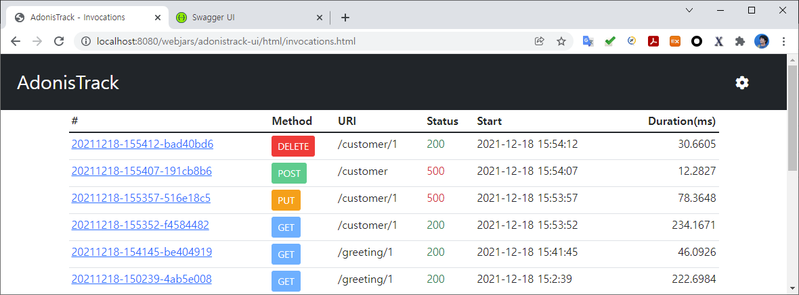
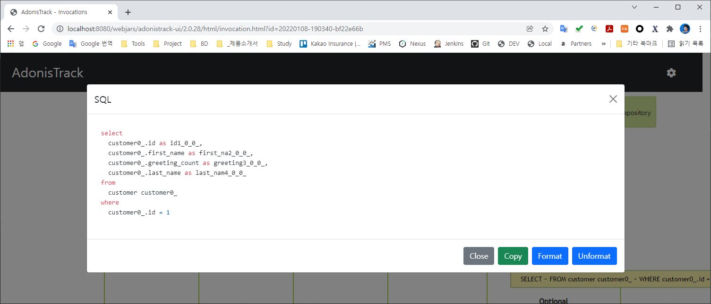

# AdonisTrack - Spring boot demo
Demo project for AdonisTrack configuration of Spring boot application

## Run demo with VM option

```
-javaagent:/your-path/aspectjweaver-1.9.6.jar
```

You can download the `aspectjweaver-1.9.6.jar` file from here.

https://repo1.maven.org/maven2/org/aspectj/aspectjweaver/1.9.6/aspectjweaver-1.9.6.jar

## Call REST API

Call the API directly. (GET API)

http://localhost:8080/greeting/1

Or, Call APIs through Swagger.

http://localhost:8080/swagger-ui/index.html?configUrl=/v3/api-docs/swagger-config#/

## Open AdonisTrack UI page

http://localhost:8080/webjars/adonistrack-ui/html/invocations.html







## Adapt to your application

### Add depencencies to your application

[pom.xml](./pom.xml)

In Maven, add dependencies to `pom.xml`.

```xml
<?xml version="1.0" encoding="UTF-8"?>
<project xmlns="http://maven.apache.org/POM/4.0.0" xmlns:xsi="http://www.w3.org/2001/XMLSchema-instance"
         xsi:schemaLocation="http://maven.apache.org/POM/4.0.0 https://maven.apache.org/xsd/maven-4.0.0.xsd">
    <!-- ... -->
    <dependencies>

        <!-- AdonisTrack -->
        <dependency>
            <groupId>com.woozooha</groupId>
            <artifactId>adonistrack</artifactId>
            <version>2.0.24</version>
        </dependency>
        <dependency>
            <groupId>com.woozooha</groupId>
            <artifactId>adonistrack-springweb</artifactId>
            <version>2.0.24</version>
        </dependency>
        <dependency>
            <groupId>com.woozooha</groupId>
            <artifactId>adonistrack-ui</artifactId>
            <version>2.0.24</version>
            <scope>runtime</scope>
        </dependency>

        <!-- For logging sql -->
        <dependency>
            <groupId>org.bgee.log4jdbc-log4j2</groupId>
            <artifactId>log4jdbc-log4j2-jdbc4.1</artifactId>
            <version>1.16</version>
        </dependency>

        <!-- For adonistrack-ui webjars url location -->
        <dependency>
            <groupId>org.webjars</groupId>
            <artifactId>webjars-locator-core</artifactId>
            <version>0.48</version>
        </dependency>

    </dependencies>

    <!-- ... -->

</project>
```

[build.gradle](./build.gradle)

In Gradle, add dependencies to `build.gradle`.

```groovy
dependencies {

    // ...

    // AdonisTrack
    implementation 'com.woozooha:adonistrack:2.0.24'
    implementation 'com.woozooha:adonistrack-springweb:2.0.24'
    runtimeOnly 'com.woozooha:adonistrack-ui:2.0.24'

    // For logging sql
    implementation 'org.bgee.log4jdbc-log4j2:log4jdbc-log4j2-jdbc4.1:1.16'

    // For adonistrack-ui webjars url location
    implementation 'org.webjars:webjars-locator-core:0.48'
}
```

### Application configuration to profile

This part is the most **important** and can be **tricky**.

Modify this @Pointcut expression according to your situation.
For example, change "com.woozooha.demo" to your application top-level package name "com.yourcompany.killerapp".

In this example, resources under the "com.woozooha.demo.config" are excluded.
The reason for this setting is that it is not called during execution and an error occurs during initialization.

For the pointcut expression, refer to this documentation.

https://docs.spring.io/spring-framework/docs/current/reference/html/core.html#aop-pointcuts

[AdonisTrackAspect.java](./src/main/java/com/woozooha/demo/config/AdonisTrackAspect.java)

```java
@Aspect
@Component
public class AdonisTrackAspect extends ProfileAspect {

    @Pointcut("execution(* *(..)) && (" +
            "within(com.woozooha.demo..*) || " +
            "within(org.springframework.data.repository.Repository+)" +
            ") && !within(com.woozooha.demo.config..*)")
    public void executionPointcut() {
    }

    @Override
    protected boolean useMemoryWriter() {
        return false;
    }

    @Override
    protected boolean useFileWriter() {
        return true;
    }

}
```

It is absolutely necessary to set up to exclude resources that cause errors.
In this example, the setting is ...

```
!within(com.woozooha.demo.config..*)
```

### Set `AdonisTrackHttpTraceFilter` on API endpoints

[AdonisTrackConfig.java](./src/main/java/com/woozooha/demo/config/AdonisTrackConfig.java)

If you are using Spring boot actuator, use AdonisTrackHttpTraceFilter.

```java
@Configuration
public class AdonisTrackConfig {

    @Bean
    public HttpTraceRepository httpTraceRepository() {
        return new InMemoryHttpTraceRepository();
    }

    @Bean
    public FilterRegistrationBean<AdonisTrackHttpTraceFilter> adonisTrackHttpTraceFilter(HttpTraceRepository repository, HttpExchangeTracer tracer) {
        FilterRegistrationBean<AdonisTrackHttpTraceFilter> registrationBean = new FilterRegistrationBean<>();
        registrationBean.setFilter(new AdonisTrackHttpTraceFilter(repository, tracer));
        registrationBean.addUrlPatterns("/greeting/*", "/customer/*");

        return registrationBean;
    }

}
```

### Configure load-time-weaving

[META-INF/aop.xml](./src/main/resources/META-INF/aop.xml)

Adonistrack supports load-time-weaving for even more powerful profiling.
If you want to profile Sql-spy based SQL queries, Transaction, do the following.

```xml
<!DOCTYPE aspectj PUBLIC "-//AspectJ//DTD//EN" "http://www.eclipse.org/aspectj/dtd/aspectj.dtd">
<aspectj>
    <weaver options="-verbose">
        <include within="java.sql.Connection+" />
        <include within="java.sql.Statement+" />
        <include within="com.woozooha.adonistrack.aspect.TransactionAspect" />
        <include within="com.woozooha.adonistrack.aspect.SqlSpyAspect" />
        <exclude within="net.sf.log4jdbc.sql.jdbcapi.ConnectionSpy" />
        <exclude within="com.zaxxer.hikari..*" />
    </weaver>
    <aspects>
        <aspect name="com.woozooha.adonistrack.aspect.TransactionAspect" />
        <aspect name="com.woozooha.adonistrack.aspect.SqlSpyAspect" />
    </aspects>
</aspectj>
```

### Change jdbc url and driver

[application.yml](./src/main/resources/application.yml)

Change jdbc url and jdbc driver for SQL logging.

```yml
spring:
  datasource:
    url: jdbc:log4jdbc:mysql://localhost:3309/demo
    # ...
    driver-class-name: net.sf.log4jdbc.sql.jdbcapi.DriverSpy
```
