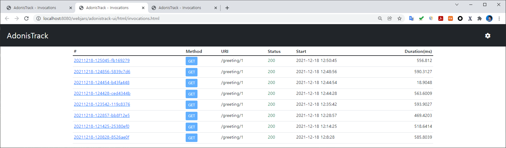
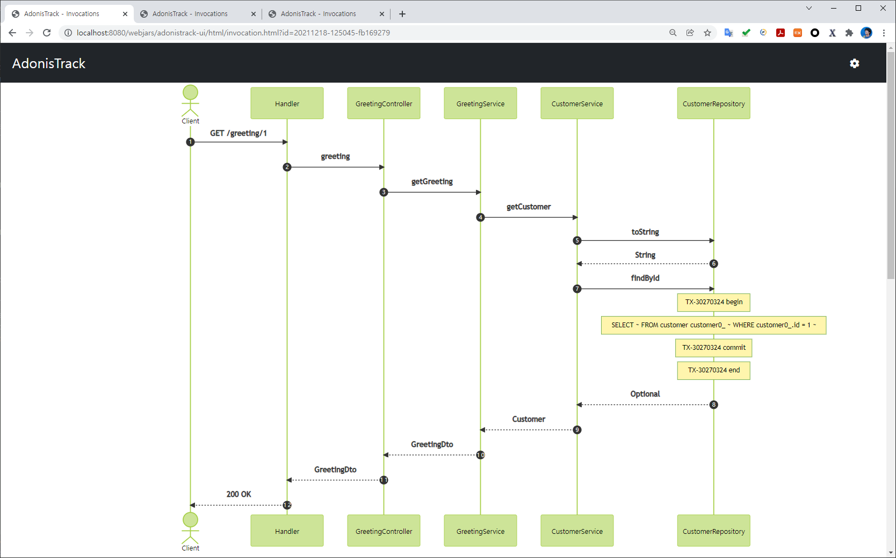
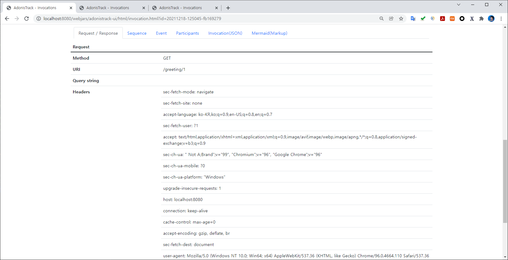
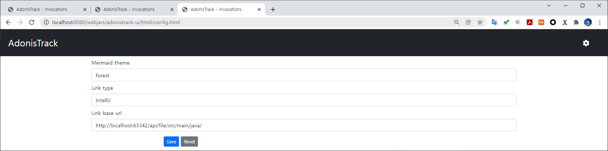

# adonistrack-spring-demo
Demo project for AdonisTrack configuration of Spring application

## Run demo with VM option
```
-javaagent:/your-path/aspectjweaver-1.9.6.jar
```

## Call REST API (GET)

http://localhost:8080/greeting/1

## Open AdonisTrack UI page

http://localhost:8080/webjars/adonistrack-ui/html/invocations.html









## Application configuration to profile

AdonisTrackAspect.java

```java
@Aspect
@Component
public class AdonisTrackAspect extends ProfileAspect {

    @Pointcut("execution(* *(..)) && (" +
            "within(com.woozooha.demo..*) || " +
            "within(org.springframework.data.repository.Repository+)" +
            ") && !within(com.woozooha.demo.config..*)")
    public void executionPointcut() {
    }

    @Override
    protected boolean useMemoryWriter() {
        return false;
    }

    @Override
    protected boolean useFileWriter() {
        return true;
    }

}
```

AdonisTrackConfig.java

```java
@Configuration
public class AdonisTrackConfig {

    @Bean
    public HttpTraceRepository httpTraceRepository() {
        return new InMemoryHttpTraceRepository();
    }

    @Bean
    public FilterRegistrationBean<AdonisTrackHttpTraceFilter> adonisTrackHttpTraceFilter(HttpTraceRepository repository, HttpExchangeTracer tracer) {
        FilterRegistrationBean<AdonisTrackHttpTraceFilter> registrationBean = new FilterRegistrationBean<>();
        registrationBean.setFilter(new AdonisTrackHttpTraceFilter(repository, tracer));
        registrationBean.addUrlPatterns("/greeting/*");

        return registrationBean;
    }

}
```

META-INF/aop.xml

```xml
<!DOCTYPE aspectj PUBLIC "-//AspectJ//DTD//EN" "http://www.eclipse.org/aspectj/dtd/aspectj.dtd">
<aspectj>
    <weaver options="-verbose">
        <include within="java.sql.Connection+" />
        <include within="java.sql.Statement+" />
        <include within="com.woozooha.adonistrack.aspect.TransactionAspect" />
        <include within="com.woozooha.adonistrack.aspect.SqlSpyAspect" />
        <exclude within="net.sf.log4jdbc.sql.jdbcapi.ConnectionSpy" />
        <exclude within="com.zaxxer.hikari..*" />
    </weaver>
    <aspects>
        <aspect name="com.woozooha.adonistrack.aspect.TransactionAspect" />
        <aspect name="com.woozooha.adonistrack.aspect.SqlSpyAspect" />
    </aspects>
</aspectj>
```

pom.xml

```xml
<?xml version="1.0" encoding="UTF-8"?>
<project xmlns="http://maven.apache.org/POM/4.0.0" xmlns:xsi="http://www.w3.org/2001/XMLSchema-instance"
         xsi:schemaLocation="http://maven.apache.org/POM/4.0.0 https://maven.apache.org/xsd/maven-4.0.0.xsd">
    <!-- ... -->
    <dependencies>

        <!-- AdonisTrack -->
        <dependency>
            <groupId>com.woozooha</groupId>
            <artifactId>adonistrack</artifactId>
            <version>2.0.24</version>
        </dependency>
        <dependency>
            <groupId>com.woozooha</groupId>
            <artifactId>adonistrack-springweb</artifactId>
            <version>2.0.24</version>
        </dependency>
        <dependency>
            <groupId>com.woozooha</groupId>
            <artifactId>adonistrack-ui</artifactId>
            <version>2.0.24</version>
        </dependency>

        <!-- For logging sql -->
        <dependency>
            <groupId>org.bgee.log4jdbc-log4j2</groupId>
            <artifactId>log4jdbc-log4j2-jdbc4.1</artifactId>
            <version>1.16</version>
        </dependency>

        <!-- For adonistrack-ui webjars url location -->
        <dependency>
            <groupId>org.webjars</groupId>
            <artifactId>webjars-locator-core</artifactId>
            <version>0.48</version>
        </dependency>

    </dependencies>

    <!-- ... -->

</project>
```